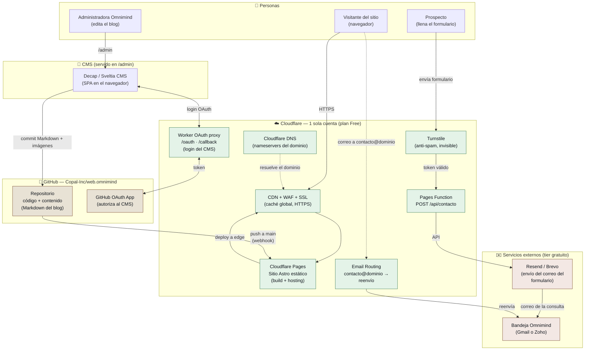

# Arquitectura del Sitio — OMNIMIND

> Documento de referencia arquitectónica. Complementa a
> [`documentacion-tecnica.md`](./documentacion-tecnica.md) y a la
> [`cotizacion.md`](./cotizacion.md).
>
> **Estado:** propuesta aprobada para implementación · **Fecha:** julio 2026 ·
> **Autor:** Copal Inc

---

## 1. Principio rector

El sitio de Omnimind es un **sitio estático (JAMstack)** generado con Astro. No
existe base de datos ni servidor de aplicación siempre encendido: el HTML se
**pre-construye** y se sirve desde el CDN. Todo lo que parece "backend"
(publicar en el blog, recibir el formulario, el correo) se resuelve con
**funciones serverless y servicios gestionados**, casi todos en el tier gratuito
de **Cloudflare**.

Esto da tres propiedades que encajan con el presupuesto y con el perfil del
cliente:

- **Costo ≈ solo el dominio.** Hosting, funciones, correo entrante y CDN son $0.
- **Sin superficie de servidor que mantener** (no hay parches de SO, ni BD, ni
  contenedores).
- **Una sola consola** (Cloudflare) para DNS, hosting, correo y seguridad.

---

## 2. Diagrama de arquitectura

---

## 3. Flujos principales

### 3.1 Visita al sitio (lectura)
1. El navegador pide `dominio.com`.
2. **Cloudflare DNS** resuelve; el **CDN** entrega el HTML pre-construido desde
   el edge más cercano (con **SSL** y **WAF** incluidos).
3. Cero cómputo por request: es HTML/CSS/JS estático. Latencia mínima.

### 3.2 Publicar un artículo en el blog (Omnimind edita)
1. La administradora entra a `dominio.com/admin` → carga el **CMS** (Decap/Sveltia).
2. Inicia sesión con GitHub; el **Worker OAuth proxy** intermedia el login
   (Cloudflare no expone el `client_secret` al navegador).
3. Escribe el artículo; al guardar, el CMS hace **commit** del archivo Markdown
   (y sube imágenes) al repo `Copal-Inc/web.omnimind`.
4. El `push` a `main` dispara el **build de Cloudflare Pages**, que reconstruye el
   sitio y lo publica en el edge. El artículo queda en línea en ~1–2 min.

> **El repositorio de GitHub es la única fuente de verdad del contenido.** No hay
> base de datos que respaldar: el historial de Git *es* el respaldo.

### 3.3 Formulario de contacto (prospecto escribe)
1. El prospecto llena el formulario; **Turnstile** valida que no es un bot (sin
   CAPTCHAs molestos).
2. El navegador hace `POST /api/contacto` a una **Pages Function**.
3. La función valida los campos y el token de Turnstile, y llama a **Resend/Brevo**
   para enviar el correo.
4. La consulta llega a la **bandeja de Omnimind**.

### 3.4 Correo entrante y saliente
- **Entrante:** cualquier correo a `contacto@dominio` lo captura **Cloudflare
  Email Routing** y lo **reenvía** a la bandeja real (Gmail/Zoho). Gratis.
- **Saliente (opcional):** Cloudflare *no envía* correo. Para responder *como*
  `@dominio` se usa **Gmail "Enviar como"** vía un relay SMTP gratuito, o un
  buzón **Zoho Mail**. Ver escenarios en la [cotización](./cotizacion.md).

---

## 4. Por qué esta arquitectura (y no otra)

| Necesidad del cliente | Solución elegida | Alternativa descartada | Motivo |
|---|---|---|---|
| Gestionar el sitio sin tocar código | Decap/Sveltia CMS (Git-based) | WordPress, Strapi | No requiere servidor ni BD; edición visual; $0 |
| Subir documentos/artículos al blog | Commits Markdown al repo + rebuild | CMS con BD | Contenido versionado en Git; respaldo gratis |
| Hosting *lightweight* y barato | Cloudflare Pages | VPS, Vercel Pro | Estático, CDN global, ancho de banda ilimitado, $0 |
| Correo propio `@dominio` | Cloudflare Email Routing (+ Zoho opc.) | Google Workspace ($) | Recibir es gratis; enviar se resuelve barato |
| Formulario funcional | Pages Function + Resend + Turnstile | Backend propio | Serverless, sin infraestructura fija, $0 |
| Presupuesto ≤ $2,000 MXN/año | Todo Cloudflare tier free | Netlify/Vercel de pago | Único costo = dominio (~$200 MXN/año) |

---

## 5. Nota sobre el estado actual vs. destino

- **Hoy:** el sitio despliega en **GitHub Pages** bajo un subdirectorio
  (`base: '/web.omnimind'`), con Decap en modo `test-repo` (sin persistencia).
- **Destino:** **Cloudflare Pages** en el dominio raíz (`base: '/'`), Decap/Sveltia
  con OAuth real, formulario conectado y correo enrutado.
- La migración es de **configuración**, no de reescritura: el código Astro se
  conserva casi íntegro. El detalle operativo está en el
  [runbook de migración](./runbook-migracion-wordpress-cloudflare.md).
